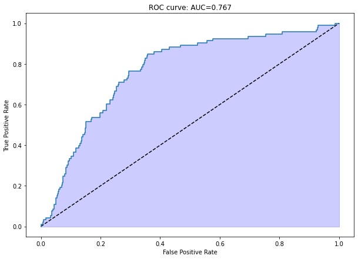

# Create a Customer Segmentation Report for Arvato Financial Services
## Installation
Run the following command to set up the environment for this project. 

```
conda create --name project_4_udacity python==3.7.3 && conda activate project_4_udacity && conda install pandas jupyterlab altair "pandas-profiling>2.0" pytest scikit-learn lightgbm hdbscan shap umap-learn imbalanced-learn
```

## Project Motivation
This is the first of several Udacity projects in the Data Science Nano-degree program. The primary aim of this project 
is therefore to complete the course-work of the mentioned program. 

The secondary aim of this project is 2 pronged:
1. To create a Customer Segmentation report for Arvato Financial Services
1. To build a Supervised model that gives us the probability of an individual becoming a customer to Arvato's client.

## File Descriptions
This project is has 2 primary folders: 
- **data** : Data Folder. It contains 2 folders
    - **processed**: Output of the analysis
    - **raw**: The raw data provided by Udacity
- **src**: Source code folder. It contains 3 files:
    - **Arvato Project Workbook**: Jupyter notebook template provided by Udacity. It is unused.
    - **Customer Segmentation Analysis**: Jupyter notebook/HTML where Part 1 of the analysis was performed.
    - **Supervised Learning Model**: Jupyter notebook/HTML where Part 2 of the analysis was performed.

## How to Interact with Project
To interact with the project, take the following steps:
1. Activate the _project_4_udacity_ environment on the Anaconda console
1. Navigate to the directory of the project on the Anaconda Console
1. Start up Jupyter Lab using the command `jupyter lab`
1. Open the Analysis notebook from the jupyter notebook page

## Results Summary
In summary:
1. The full Customer Segmentation report can be found [here]()
1. The resultant Supervised Model performed well. It achieved an **AUC of 0.767** as shown below:




## Licensing, Authors & Acknowledgements
- [How to Use t-SNE Effectively by Martin Wattenberg,Fernanda Viégas & Ian Johnson](https://distill.pub/2016/misread-tsne/)
- [How HDBSCAN Works - HDBSCAN Docs](https://hdbscan.readthedocs.io/en/latest/how_hdbscan_works.html)
- [Understanding UMAP by Andy Coenen & Adam Pearce](https://pair-code.github.io/understanding-umap/)
- [Using UMAP for Clustering - UMAP Docs](https://umap-learn.readthedocs.io/en/latest/clustering.html)
- [tSNE vs. UMAP: Global Structure by Nikolay Oskolkov](https://towardsdatascience.com/tsne-vs-umap-global-structure-4d8045acba17)
-[Census income classification with LightGBM - SHAP Docs](https://shap-lrjball.readthedocs.io/en/docs_update/example_notebooks/tree_explainer/Census%20income%20classification%20with%20LightGBM.html)
- [The right way of using SMOTE with Cross-validation by KSV Muralidhar](https://towardsdatascience.com/the-right-way-of-using-smote-with-cross-validation-92a8d09d00c7)
- [Compare over-sampling samplers - ImbLearn Docs](https://imbalanced-learn.org/stable/auto_examples/over-sampling/plot_comparison_over_sampling.html)
- [AZ Germany grid](https://www.regionale-marktdaten.de/az-deutschland-raster/)
- [PLZ8 for Germany](https://www.regionale-marktdaten.de/plz8/)